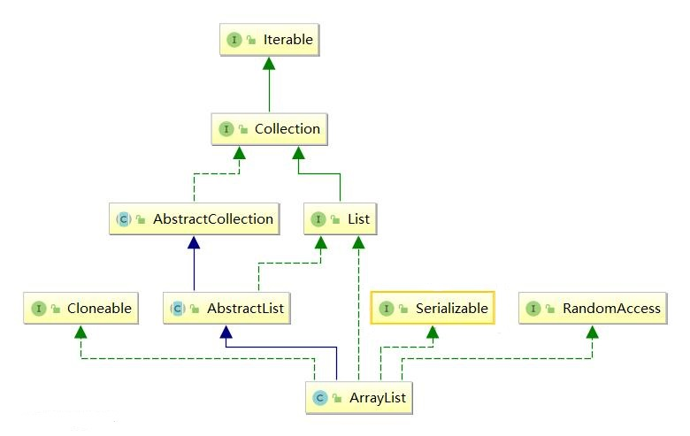

### *ArrayList源码分析*
---

#### 1.概述
+ ArrayList底层基于定长数组实现；
+ 允许空值和重复元素；
+ 扩容：当往ArrayList中添加的元素数量大于其底层数组容量时，会重新生成一个更大的数组进行扩容；
+ 实现RandomAcess标记接口，底层基于数组实现，是一片连续的内存空间，因此查找具有O(1)的复杂度；
+ 线程安全：ArrayList是非线程安全的，与之相应的线程安全类有Vector，Stack以及并发容器CopyOnWriteArrayList；
+ ArrayList类图：


#### 2.属性
```java
//默认初始容量10
private static final int DEFAULT_CAPACITY = 10; 
//容器，存放ArrayList的数据
transient Object[] elementData; 

//空数组，在有参构造方法中，当传入参数为0或传入空集合时，使用它初始化elementData
private static final Object[] EMPTY_ELEMENTDATA = {}; 
//空数组，在无参够造方法中，使用其初始化elementData
private static final Object[] DEFAULTCAPACITY_EMPTY_ELEMENTDATA = {}; 
//ArratyList大小
private int size; 
```

#### 3.重要方法
##### 3.1 构造方法
ArrayList的构造方法：
```java
// (1) 有参构造函数：传入ArrayList初始化大小
public ArrayList(int initialCapacity) {
    if (initialCapacity > 0) {
        this.elementData = new Object[initialCapacity];
    } else if (initialCapacity == 0) { 
    	//若传入参数为0，使用空数组EMPTY_ELEMENTDATA初始化elementData
        this.elementData = EMPTY_ELEMENTDATA;
    } else {
        throw new IllegalArgumentException("Illegal Capacity: "+ initialCapacity);
    }
}
// (2)无参构造函数，使用DEFAULTCAPACITY_EMPTY_ELEMENTDATA初始化elementData
public ArrayList() {
    this.elementData = DEFAULTCAPACITY_EMPTY_ELEMENTDATA;
}
// (3)使用Collection实例化ArrayList
public ArrayList(Collection<? extends E> c) {
    elementData = c.toArray(); //将集合转换成数组[]，并将引用赋值给内部数组
    // 检查传入集合情况，进行修正
    if ((size = elementData.length) != 0) { // 传入集合非空 
    	// Java 6260652 bug： toArray方法可能返回的不是Object[]数组，故在这里检查返回值
        if (elementData.getClass() != Object[].class)
            elementData = Arrays.copyOf(elementData, size, Object[].class);
    } else {
        // 传入空集合，使用空数组EMPTY_ELEMENTDATA初始化elementData
        this.elementData = EMPTY_ELEMENTDATA;
    }
}
```
综上，构造方法主要是初始化底层数组elementData，区别在于：

- 无参构造方法会将elementData初始化为空数组*DEFAULTCAPACITY_EMPTY_ELEMENTDATA*；然后在插入元素时扩容，将*DEFAULT_CAPACITY*设定的大小重新初始化数组。
- 传入初始化大小的有参构造方法则会将elementData初始化为参数值大小(>=0)的数组，其中传入0时用*EMPTY_ELEMENTDATA*初始化数组。
- 传入集合的有参构造方法，会视集合转换成数组的状况，使用转换的数组初始化elementData，或者使用*MPTY_ELEMENTDATA*初始化elementData。

大多数情况下，会使用无参的构造方法。 在明确知晓需求的大情况下，应当在初始化时限定元素个数。

##### 3.2 add()添加元素
ArrayList的插入分两种情况：(1) 一种在尾部插入，较简单；(2) 一种在其它位置插入，此种情况意味着元素的移动。

第一种，下面是在尾部插入的情况
```java
// (1) 第一种：在List尾部插入元素
public boolean add(E e) {
    ensureCapacityInternal(size + 1);  // Increments modCount!!
    // 经过扩容检查之后，在List尾部添加元素
    elementData[size++] = e;
    return true;
}

// 检查是否需要扩容
// 参数minCapacity表示当前需要的最小容量
public void ensureCapacity(int minCapacity) {
	// 首先判断一下elementData是不是通过无参构造函数完成初始化的，且是
	// 第一次添加元素的情况：若是则设置minExpand为0，意味着必须要进行扩容，也就是说
	// 通过无参构造函数构造的ArrayList，首次添加元素必须扩容；
	// 非上述情况，取最小扩容阈值为默认容量值10
    int minExpand = (elementData != DEFAULTCAPACITY_EMPTY_ELEMENTDATA)
        ? 0
        : DEFAULT_CAPACITY;

    // 按需进行扩容 
    if (minCapacity > minExpand) {
        ensureExplicitCapacity(minCapacity);
    }
}

private void ensureCapacityInternal(int minCapacity) {
	//表明是经过无参构造，且是第一添加元素时的数组扩容，选两者中的大者为大小		
    if (elementData == DEFAULTCAPACITY_EMPTY_ELEMENTDATA) { 
        minCapacity = Math.max(DEFAULT_CAPACITY, minCapacity);
    }
    // 不是上面第一次插入元素的情况，直接进入后续扩容过程
    ensureExplicitCapacity(minCapacity);
}

private void ensureExplicitCapacity(int minCapacity) {
	// modCount表示List的结构更改次数：包括添加、删除，这里因为添加元素；
    modCount++;

    // 扩容
    if (minCapacity - elementData.length > 0)
        grow(minCapacity);
}

// 扩容
private void grow(int minCapacity) {
    // 下面可能出现Integer溢出的情况
    int oldCapacity = elementData.length;
    int newCapacity = oldCapacity + (oldCapacity >> 1); // 先取为1.5倍旧容量(可能溢出)

    // 若1.5倍旧容量还不够所需大小(可能溢出)
    if (newCapacity - minCapacity < 0) 
        newCapacity = minCapacity;

    // 常量 MAX_ARRAY_SIZE = Integer.MAX_VALUE - 8
    // 超过此值，调用hugeCapacity方法判断是minCapacity否溢出：
    // a. 没有溢出时取Integer.MAX_VALUE，
    // b. 溢出时抛出异常OutOfMemoryError
    if (newCapacity - MAX_ARRAY_SIZE > 0)
        newCapacity = hugeCapacity(minCapacity);

    // 元素复制：将元素数据复制到新申请的数组里
    elementData = Arrays.copyOf(elementData, newCapacity);
}

// 针对特大的ArrayList，判断是否传入ArrayList的大小参数溢出
private static int hugeCapacity(int minCapacity) {
	// int溢出，变为负数
    if (minCapacity < 0) // overflow
        throw new OutOfMemoryError();
    // 大小上限值
    return (minCapacity > MAX_ARRAY_SIZE) ?
        Integer.MAX_VALUE :
        MAX_ARRAY_SIZE;
}
```

接下来是第二种插入情况，在非尾部的位置插入元素，且需要指定元素的插入位置

```java
// (2) 第二种，在指定位置插入元素
public void add(int index, E element) {
	// 检查范围
    rangeCheckForAdd(index);
    // 检查是否需要扩容，具体代码在上面
    ensureCapacityInternal(size + 1);  // Increments modCount!!
    // 复制数组元素，效果就是index后面的整体后移一个位置
    System.arraycopy(elementData, index, elementData, index + 1, size - index);

    // 插入元素，并更新size
    elementData[index] = element;
    size++;
}

// 下标越界检查
private void rangeCheckForAdd(int index) {
    if (index > size || index < 0)
        throw new IndexOutOfBoundsException(outOfBoundsMsg(index));
}
```

##### 3.3 remove()删除元素
删除元素分为两种情况，第一种根据给定索引值进行删除，此时需要检查索引越界，同时返回被删除的元素；第二种删除给定元素，执行快速删除，也就是不进行边界检查和返回被删除值，本来传入的就是被删除的元素，这里返回没有必要，多此一举。
```java
// 第一种：指定删除索引值
public E remove(int index) {
    rangeCheck(index); 	//检查是否越界
    modCount++; //更新结构修改次数
    E oldValue = elementData(index); //保存被删除的值，以便最后返回
    int numMoved = size - index - 1; //需要移动的元素个数
    if (numMoved > 0) //数组元素复制，即index后面元素整体左移1个
        System.arraycopy(elementData, index+1, elementData, index, numMoved);
    elementData[--size] = null; // 将删除之前的尾部元素指向null，帮助GC
    return oldValue;
}

// 第二种：根据给定元素进行删除，
// 显然当ArrayList中有重复元素时，只会删除下标值最小的那一个。
public boolean remove(Object o) {
    if (o == null) { //待删除元素为null
        for (int index = 0; index < size; index++)
            if (elementData[index] == null) {
                fastRemove(index);
                return true;
            }
    } else { //待删除元素不为null
        for (int index = 0; index < size; index++)
            if (o.equals(elementData[index])) {
                fastRemove(index);
                return true;
            }
    }
    // 没有找到待删除元素
    return false;
}

// 快速删除，不进行边界检查，也不返回被删除的值
private void fastRemove(int index) {
    modCount++; //更新结构修改次数
    int numMoved = size - index - 1;
    if (numMoved > 0)
        System.arraycopy(elementData, index+1, elementData, index, numMoved);
    elementData[--size] = null; // clear to let GC do its work
}
```
##### 3.3 get() & set() & clear() & trimToSize()方法
clear()方法清空所有元素：
```java
// 清空所有元素
public void clear() {
    modCount++;
    // clear to let GC do its work
    for (int i = 0; i < size; i++)
        elementData[i] = null
    size = 0;
}
```
get()和set()方法：
```java
public E get(int index) {
    rangeCheck(index); //边界检查
    return elementData(index);
}

public E set(int index, E element) {
    rangeCheck(index); //边界检查
    E oldValue = elementData(index);
    elementData[index] = element;
    return oldValue;
}
```
trimToSize()方法，将ArrayList压缩至size大小，将大量增加和删除操作之后导致的空闲空间释放。
```java
public void trimToSize() {
    modCount++;
    if (size < elementData.length) {
        elementData = (size == 0)
          ? EMPTY_ELEMENTDATA
          : Arrays.copyOf(elementData, size);
    }
}
```

#### 4.快速失败机制
Java集合框架中有很多类实现了快速失败机制，如LinkedList，HashMap等，即在发生并发修改的情况下，将触发抛出并发修改异常 - ConcurrentModificationException，其是通过迭代器类 *Itr* 中的expectedModCount，在迭代时与modCount变量比较是否相同进行判断的。 
```java
// Itr是用于AbstractList的经过优化的迭代器
private class Itr implements Iterator<E> {
    int cursor;       // index of next element to return
    int lastRet = -1; // index of last element returned; -1 if no such

    // 其expectedModCount变量，用于在迭代过程中检验是否发生并发修改，
    // 若发生并发修改，则抛出并发修改异常，即快速失败机制。
    int expectedModCount = modCount; 

    public boolean hasNext() {
        return cursor != size;
    }

    @SuppressWarnings("unchecked")
    public E next() {
        checkForComodification();
        int i = cursor;
        if (i >= size)
            throw new NoSuchElementException();
        Object[] elementData = ArrayList.this.elementData;
        // ConcurrentModificationException ...
        if (i >= elementData.length)
            throw new ConcurrentModificationException();
        cursor = i + 1;
        return (E) elementData[lastRet = i];
    }

    public void remove() {
        if (lastRet < 0)
            throw new IllegalStateException();
        // 检查是发生否并发修改
        checkForComodification();

        try {
            ArrayList.this.remove(lastRet);
            cursor = lastRet;
            lastRet = -1;
            expectedModCount = modCount;
        } catch (IndexOutOfBoundsException ex) {
            throw new ConcurrentModificationException();
        }
    }

    @Override
    @SuppressWarnings("unchecked")
    public void forEachRemaining(Consumer<? super E> consumer) {
        Objects.requireNonNull(consumer);
        final int size = ArrayList.this.size;
        int i = cursor;
        if (i >= size) {
            return;
        }
        final Object[] elementData = ArrayList.this.elementData;

        // 迭代中数组大小发生改变，必然发生否并发修改
        if (i >= elementData.length) {
            throw new ConcurrentModificationException();
        }
        while (i != size && modCount == expectedModCount) {
            consumer.accept((E) elementData[i++]);
        }
        // update once at end of iteration to reduce heap write traffic
        cursor = i;
        lastRet = i - 1; 
        checkForComodification(); //并发修改检查
    }

    // 检测是否发生并发修改
    final void checkForComodification() {
        if (modCount != expectedModCount)
            throw new ConcurrentModificationException();
    }
}
```
ArrayList迭代器中方法均支持快速失败机制，在有其它线程并发修改时，迭代器会快速失败。这样可以避免程序在将来不确定的时间里出现不确定的行为。

#### 5.关于源码中提到的 *Java 6260652 bug*
官网bug描述地址：[*6260652:Arrays.asList(x).toArray().getClass() should be Object[].class*](https://bugs.java.com/bugdatabase/view_bug.do?bug_id=6260652)，此bug是2005年提出，现已修复。

下面节选自官网的Bug问题描述：

The Collection documentation claims that

`collection.toArray()`

is "identical in function" to

`collection.toArray(new Object[0]);`

However, the implementation of `Arrays.asList` does not follow this: If created with an array of a subtype (e.g. String[]), its toArray() will return an array of the same type (because it use clone()) instead of an Object[].

If one later tries to store non-Strings (or whatever) in that array, an ArrayStoreException is thrown.

Either the `Arrays.asList()` implementation (which may return an array of component type not Object) or the Collection toArray documentation (which does not allow argumentless toArray() to return arrays of subtypes of Object) is wrong.


也就是说Arrays.asList创建的ArrayList，需要注意此ArrayList是Arrays中的内部类，调用其toArray方法返回的是带有具体类型的数组T[]，而不是Object[]。
```java
// Arrays#asList()方法
public static <T> List<T> asList(T... a) {
    return new ArrayList<>(a); //ArrayList为其内部类
}

// Arrays内部类ArrayList
private static class ArrayList<E> extends AbstractList<E>
    implements RandomAccess, java.io.Serializable
{
    private static final long serialVersionUID = -2764017481108945198L;
    //内部数组类型与java.util.ArrayList不同，不是Object[]，带有具体类型
    private final E[] a; 

    ArrayList(E[] array) {
        // E[] 数组
        a = Objects.requireNonNull(array);
    }

    @Override
    public Object[] toArray() {
        return a.clone(); //经过clone返回的仍然是E[]
    }

    @Override
    @SuppressWarnings("unchecked")
    public <T> T[] toArray(T[] a) {
        int size = size();
        if (a.length < size)
            return Arrays.copyOf(this.a, size,
                                 (Class<? extends T[]>) a.getClass());
        System.arraycopy(this.a, 0, a, 0, size);
        if (a.length > size)
            a[size] = null;
        return a;
    }
    // 省略其它代码... 
}
```
由上面代码可以看出Arrays.asList()得到的List在调用toArray()方法返回的不一定是Object[]，非常有可能是E[]。

这与java.util.ArrayList中toArray方法不一样，如下面代码所示，ArrayList中的elementData是Object[]，因此经copyOf()方法返回的也是Object[]类型。
```java
// ArrayList#toArray()
public Object[] toArray() {
    return Arrays.copyOf(elementData, size);
}

// Arrays#copyOf()
public static <T> T[] copyOf(T[] original, int newLength) {
    return (T[]) copyOf(original, newLength, original.getClass());
}
```

#### 6.总结

一个需要注意的细节：foreach时删除元素
- foreach是个语法糖，在编译完成后相关的字节码后会被转换成用迭代器遍历的方式，也就是foreach中直接使用集合的remove方法，和下面代码展示的效果是一致的：

```java
// #00代码示例00#
ArrayList<String> list = new ArrayList();
// 省略一些向list添加元素的代码...
Iterator it = list.iterator()
while(it.hasNext()){
	String tmp = it.next();
	if ("element_to_delete".equals(tmp)) {
		list.remove(tmp); // 错误用法
		it.remove(); // 正确用法 ✔
	}
}
```

- 不要在foreach循环里进行元素的remove或add操作，会导致*ConcurrentModificationException*；删除元素应当使用Iterator中的remove()方法，若并发操作，需要对Iterator对象加锁。

- 为什么会导致*ConcurrentModificationException*？因为迭代器遍历的next()方法会检查迭代过程中*modCount*变量的值是否发生改变，而集合中的添加或者删除方法否会导致*modCount*的值发生累加，而迭代器中的remove()方法虽然也是调用了集合的remove()方法，但它更新了expectedModCount值，这样在下次next的时候检查并发修改时就不会抛出异常。代码如下：
```java
// 迭代器中的删除方法
public void remove() {
    if (lastRet < 0)
        throw new IllegalStateException();
    // 检查是发生否并发修改
    checkForComodification();
    try {
        ArrayList.this.remove(lastRet);
        cursor = lastRet;
        lastRet = -1;
        expectedModCount = modCount; //更新结构修改次数
    } catch (IndexOutOfBoundsException ex) {
        throw new ConcurrentModificationException();
    }
}

```

- 此外，在上面代码示例#00代码示例00#中，while循环中调用了hasNext()方法，若此时ArrayList中只有2个元素，当第一次循环list.remove(tmp)删除一个元素后，size将变为1。此时cursor==1 & size==1，hasNext()方法将会返回false，因此提前结束迭代，不会发生任何异常。分析hasNext()方法可知，当满足cursor + 1 = size的关系时，删除当前元素会导致没有遍历到最后一个元素就提前跳出while循环，且不抛出任何异常。
```java
public boolean hasNext() {
    return cursor != size;
}
```