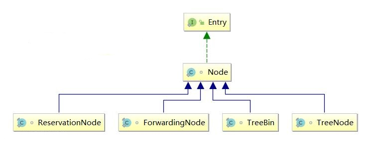

### *ConcurrentHashMap源码分析*
---
#### 1.概述

+ HashMap是非线程安全的，在JDK1.5之前，通常使用HashTable作为HashMap的线程安全版本使用。
+ JDK1.7是基于Segement分段锁和Node实现的。DEFAULT_CONCURRENCY_LEVEL=16表示默认的并发度，表示CHM维护了多少个分段锁Segement，Segement继承自ReentrantLock；在定位的时候会进行两次哈希，第一次定位到哪一把分段所，第二次哈希则定位桶...
+ JDK1.8基于Node + CAS + synchronized实现，不再使用JDK1.7的设计。
+ 与HashMap一致，对于哈希冲突，引起了链表和红黑树两种结构。

#### 2.字段
ConcurrentHashMap中定义的常量以及一些对象属性
```java
/* ---------------- 1. Constants -------------- */
private static final int MAXIMUM_CAPACITY = 1 << 30;
private static final int DEFAULT_CAPACITY = 16; //默认容量值
/*虚拟机限制数组最大长度，主要用于toArray方法*/
static final int MAX_ARRAY_SIZE = Integer.MAX_VALUE - 8;

/* 在JDK1.8中，没太用到，为兼容而保留。在JDK1.7中描述并发度，与分段锁有关；
   1.8中实际的并发度应该是与实时的用到桶个数关联的，锁的粒度由分段细化到了桶*/
private static final int DEFAULT_CONCURRENCY_LEVEL = 16; //默认并发度
private static final float LOAD_FACTOR = 0.75f; //兼容保留字段
static final int TREEIFY_THRESHOLD = 8; //树化阈值
static final int UNTREEIFY_THRESHOLD = 6; //树转换成链表阈值
static final int MIN_TREEIFY_CAPACITY = 64; //树化的前提，容量达到64+

/* 扩容操作的transfer允许多线程，MIN_TRANSFER_STRIDE表示一个线程执行transfer时，
   最少要对连续的16个hash桶进行transfer，
   即单线程执行transfer时的步进最小为16，
   在实际使用根据CPU核心数计算得到的步进小于此值时，步进取16
   第一次扩容时显然是由一个单线程完成的 */
private static final int MIN_TRANSFER_STRIDE = 16;

// 虽然不是final，但是在CHM中并没有提供修改的接口，是作为常量使用的.
private static int RESIZE_STAMP_BITS = 16;
// 控制扩容线程数量
private static final int MAX_RESIZERS = (1 << (32 - RESIZE_STAMP_BITS)) - 1;
/** * The bit shift for recording size stamp in sizeCtl. */
private static final int RESIZE_STAMP_SHIFT = 32 - RESIZE_STAMP_BITS;
// 特殊类型Node的哈希编码值，用于区分不同的Node子类型
static final int MOVED     = -1; // hash for forwarding nodes
static final int TREEBIN   = -2; // hash for roots of trees
static final int RESERVED  = -3; // hash for transient reservations
static final int HASH_BITS = 0x7fffffff; // usable bits of normal node hash
static final int NCPU = Runtime.getRuntime().availableProcessors(); //计算线程扩容步进值

/*----------------------2.对象字段----------------------------*/
private transient volatile int sizeCtl;
// 扩容时使用，用于标记切分转移任务时剩余桶树
private transient volatile int transferIndex;
// 底层容器数组，通过迭代器访问
transient volatile Node<K,V>[] table;
// 扩容时临时表，用于转移数据，仅在扩容时非null
private transient volatile Node<K, V>[] nextTable;

/* CHM计数使用：但CHM的场景导致了其存储元素数量变化频繁，故统计出总会是一个近似值，估计值*/
/** * Spinlock (locked via CAS) used when resizing and/or creating CounterCells. */
private transient volatile int cellsBusy;
/** * Table of counter cells. When non-null, size is a power of 2. */
private transient volatile CounterCell[] counterCells;

// views，用于迭代，CHM场景决定了其迭代器具有弱一致性
private transient KeySetView<K,V> keySet;
private transient ValuesView<K,V> values;
private transient EntrySetView<K,V> entrySet;
```

#### 3.结点相关的内部类

ConcurrentHashMap中定义了几个结点相关的内部类:



+ Node实现了Map.Entry接口，是基本结点，用作链表结点，存放实际数据。
+ TreeNode用作红黑树中的普通结点，存放实际数据。
+ TreeBin并不存放实际数据，它持有红黑树头结点的引用，并维护了读写其指向的红黑树的锁；其hash值固定为-2，TREEBIN。
+ ForwardingNode一种临时结点，扩容时使用其做桶的标记，并不存放实际数据；其hash值固定为-1，MOVED。
+ ReservationNode保留结点，在computeIfAbsent和compute中会用到;其hash值固定为-3，RESERVED。

后面三种结点类型不用于保存实际数据，在特定场合下使用，而且结点哈希值也是固定的；Node或者TreeNode存放实际数据，它们的哈希值经过哈希函数计算得到，显然是非负的。

#### 4.构造方法
构造方法初根据传入Map的构造方法之外，其余的只是初始化参数，并没有初始化底层数组，底层数组table在第一次添加元素时进行初始化。
```java
// 构造一个空CHM
public ConcurrentHashMap() {}
public ConcurrentHashMap(int initialCapacity) {
    if (initialCapacity < 0)
        throw new IllegalArgumentException();
    // 判断调整容量初值
    int cap = ((initialCapacity >= (MAXIMUM_CAPACITY >>> 1)) ?
               MAXIMUM_CAPACITY :
               tableSizeFor(initialCapacity + (initialCapacity >>> 1) + 1));
    this.sizeCtl = cap;
}
// 根据传入Map构造
public ConcurrentHashMap(Map<? extends K, ? extends V> m) {
    this.sizeCtl = DEFAULT_CAPACITY;
    putAll(m);
}
public ConcurrentHashMap(int initialCapacity, float loadFactor) {
    this(initialCapacity, loadFactor, 1); //并发度设为1
}
public ConcurrentHashMap(int initialCapacity, float loadFactor, int concurrencyLevel) {
    if (!(loadFactor > 0.0f) || initialCapacity < 0 || concurrencyLevel <= 0)
        throw new IllegalArgumentException();
    if (initialCapacity < concurrencyLevel)   // Use at least as many bins
        initialCapacity = concurrencyLevel;   // as estimated threads
    long size = (long)(1.0 + (long)initialCapacity / loadFactor);
    int cap = (size >= (long)MAXIMUM_CAPACITY) ?
        MAXIMUM_CAPACITY : tableSizeFor((int)size);
    this.sizeCtl = cap;
}
```

#### 5.重要方法

##### 5.1 resizeStamp方法

resizeStamp方法用于计算扩容戳值
```java
// 重新计算扩容戳值
static final int resizeStamp(int n) {
    // numberOfLeadingZeros计算高位有几个零 
    // 返回结果：范围是0~32，负数时为0， 如n =1, 则返回31，n=2,3 则返回30；
    // n取Interger.MaxValue则返回1...
    // 接下来往左移位15， 因为numberOfLeadingZeros(n)取值范围0~32，
    // 其结果也就等于2^15 + numberOfLeadingZeros(n)
    return Integer.numberOfLeadingZeros(n) | (1 << (RESIZE_STAMP_BITS - 1));
}
```
在addCount方法中调用transfer的线程才有可能是某一轮次扩容的第一个线程，此时会设置sizeCtl的值为

`U.compareAndSwapInt(this, SIZECTL, sc, (rs << RESIZE_STAMP_SHIFT) + 2))`

其中rs = resizeStamp(n)，也就是sizeCtl = resizeStamp(n) << 16 + 2，显然其为负数。这个值用于transfer方法中，在每次扩容时对是否是轮次内的最后一个线程的判定。

由于ConcurrentHashMap的容量为16 ~ 2^30，所以rs的取值范围是2^15+2(2^29，最大可扩容的容量值) ~ 2^15+27(对应于容量16)，

因此对于左移16位的+2即为sizeCtl的扩容初始值，这是一个负数值，再考虑计算机负数的补码表示形式。以n取16为例，其rs=27，左移16表示其低16位为0，高16位为(1000,0000,0001,1011)，则rs+2表示sizeCtl的初始值，则初始值高16位不变(1000,0000,0001,1011)，低16位为(0000,0000,0000,0010)，因此扩容线程每增加一个，则低16位+1，每减少一个扩容线程低16位部分减1。也就是在扩容时sizeCtl在高16位标识不同轮次，即某个扩容轮次的sizeCtl高16位是不变的，且一个ConcurrentHashMap对象的容量只能是递增的，且显然只能进行有限次的扩容，每一轮次的高16位值经过resizeStamp计算是不一样的；低16位表示扩容线程数量，若有N个线程在扩容，则其低16位值应该是N+1...


显然即便是扩容线程数为最大值 MAX_RESIZERS = (1 << (32 - RESIZE_STAMP_BITS)) - 1 = 1<<16 - 1， 并发扩容线程的加减也不会使得sizeCtl的取值为正数；况且实际上在切分扩容任务时，线程每次分配的桶数量导致并发扩容的线程远没有前面所说的MAX_RESIZERS那么大，若CPU核心数为1，显然只会让一个线程去完成扩容动作；当原容量很大时且多核心的情况下取值n/8Ncpu，则最大的并发扩容线程数仅为8NCpu+部分进入transfer方法但没有分配到转移任务的线程数量。控制扩容线程的并发数也是为了减少线程调度以及切换的开销。

```java
if ((stride = (NCPU > 1) ? (n >>> 3) / NCPU : n) < MIN_TRANSFER_STRIDE)
    stride = MIN_TRANSFER_STRIDE; // subdivide range
```

故在扩容时sizeCtl的值始终为负数...

且个人认为源码中对于sizeCtl处的注释是有一处是有疑义的

```java
/**
 * Table initialization and resizing control.  When negative, the
 * table is being initialized or resized: -1 for initialization,
 * else -(1 + the number of active resizing threads).  Otherwise,
 * when table is null, holds the initial table size to use upon
 * creation, or 0 for default. After initialization, holds the
 * next element count value upon which to resize the table.
 */
private transient volatile int sizeCtl;
```

注释中When negative, the table is being initialized or resized: -1 for initialization,  else -(1 + the number of active resizing threads). 表示当sizeCtl为负数时，取值-1表示CHM正在初始化；其余负数情况 -(1+N)，N表示扩容线程活跃数量，通过前面分析，sizeCtl的低16位表示的是扩容线程数量(N+1)，与这里不太契合。

对于扩容线程的增加减少：在addCount和helpTransfer中会增加扩容线程数，即CAS尝试将sizeCtl+1；在transfer方法中完成分配任务或者没有分配到任务退出时会将扩容线程数减1。


##### 5.2 put方法

```java
// 
final V putVal(K key, V value, boolean onlyIfAbsent) {
    // ConcurrentHashMap中key和value不允许为null，NullPointerException
    if (key == null || value == null) throw new NullPointerException();
    /* return (h ^ (h >>> 16)) & HASH_BITS; 使高16位参与散列，更均匀 减少哈希碰撞*/
    int hash = spread(key.hashCode()); 
    int binCount = 0; //记录结点元素个数，用于控制扩容或者转移为树

    // CHM放入元素时，逻辑是在循环中，也就是直到放入成功，才会从循环中退出
    for (Node<K,V>[] tab = table;;) {
        Node<K,V> f; int n, i, fh;

        // 1.首次插入结点，初始化底层数组table
        if (tab == null || (n = tab.length) == 0) 
            tab = initTable();

        // 2.定位到的桶为空
        else if ((f = tabAt(tab, i = (n - 1) & hash)) == null) { 
            // CAS添加结点到桶，若CAS操作成功，则表示添加元素成功
            if (casTabAt(tab, i, null, 
                         new Node<K,V>(hash, key, value, null))) // CAS
                break;                   // CAS设置成功，退出循环，这种情况不需要加锁
        }
        // 3.扩容中：MOVED表示，CHM正处于扩容中，处于复制底层数组元素到新数组的状态
        else if ((fh = f.hash) == MOVED) 
            tab = helpTransfer(tab, f); // 帮助复制数组

        // 4.定位到桶已经有元素存在，此时竞争获取桶内第一个元素的内置锁
        else {
            V oldVal = null;
            synchronized (f) { 
                // 获取到锁之后，首先检查桶内第一个元素还在索引i的地方，若换地方了，
                // 则表示经过扩容操作之后，挪位置了，如挪到索引更大的桶中；
                // 或者被删除；那么即便是这里获得了锁，但是也已经没意义了，
                // 状态已经失效了，那么只能进入下一次for循环中，视具体情况选择合适分支进行处理，
                // 或者需要经过许多次循环，但终究会被放进去...
                if (tabAt(tab, i) == f) { // 
                    if (fh >= 0) { // (1) fh>0，结点非树头节点 是链表结点
                        binCount = 1;
                        for (Node<K,V> e = f;; ++binCount) { //遍历链表
                            K ek;
                            if (e.hash == hash &&
                                ((ek = e.key) == key ||
                                 (ek != null && key.equals(ek)))) {
                                oldVal = e.val; // 记录旧值引用
                                // 若key已存在链表中，替换
                                if (!onlyIfAbsent) 
                                    e.val = value;
                                break;
                            }
                            Node<K,V> pred = e;
                            // 遍历到链表尾部，添加结点
                            if ((e = e.next) == null) { 
                                pred.next = new Node<K,V>(hash, key,
                                                          value, null);
                                break;
                            }
                        }
                    }
                    // (2) 桶内结构为红黑树，当前桶内第一个结点为TreeBin类型
                    else if (f instanceof TreeBin) {
                        Node<K,V> p;
                        binCount = 2;
                        if ((p = ((TreeBin<K,V>)f).putTreeVal(hash, key,
                                                       value)) != null) {
                            oldVal = p.val; //保存旧值的引用
                            if (!onlyIfAbsent)
                                p.val = value;
                        }
                    }
                }
            }
            if (binCount != 0) { // 判断链表是否需要转换成红黑树
                if (binCount >= TREEIFY_THRESHOLD) 
                    treeifyBin(tab, i);
                if (oldVal != null)
                    return oldVal;
                break;
            }
        }
    }
    addCount(1L, binCount); //size计数，并且在方法中会判断是否需要扩容，是否帮助扩容
    return null;
}

/*根据sizeCtl初始化数组table，线程尝试竞争table初始化任务，竞争失败则等待其它线程完成初始化，然后返回进行putVal的逻辑；
  成功的线程则开始初始化table，并设置扩容阈值。*/
private final Node<K,V>[] initTable() {
    Node<K,V>[] tab; int sc;
    while ((tab = table) == null || tab.length == 0) {
        if ((sc = sizeCtl) < 0) // sizeCtl < 0 表示已经有其它线程在初始化table，
            // 当前线程竞争初始化任务失败，自旋挂起直到其它线程完成对table初始化，然后退出while循环
            Thread.yield(); 
        // CAS尝试
        else if (U.compareAndSwapInt(this, SIZECTL, sc, -1)) { //CAS尝试设置sizeCtl为-1
            try { //设置sizeCtl成功，说明线程竞争得到初始化任务
                if ((tab = table) == null || tab.length == 0) { // table未初始化
                    // sc记录了开始sizeCtl的值，若大于0，表示容量
                    int n = (sc > 0) ? sc : DEFAULT_CAPACITY; 

                    // 申请数组空间，并初始化底层数组table
                    @SuppressWarnings("unchecked")
                    Node<K,V>[] nt = (Node<K,V>[])new Node<?,?>[n]; 
                    table = tab = nt;  //更新数组引用
                    sc = n - (n >>> 2); // 记录下次扩容阈值：0.75*capacity
                }
            } finally {
                sizeCtl = sc; // 设置下次扩容阈值
            }
            break;
        }
    }
    return tab; //返回初始化完成的底层数组
}
```

接下来看一下helpTransfer方法
```java
// 线程存放元素时，发现正在扩容，则帮助移动数组元素
final Node<K,V>[] helpTransfer(Node<K,V>[] tab, Node<K,V> f) {
    Node<K,V>[] nextTab; int sc;
    // 判断是否还在扩容中...
    if (tab != null && (f instanceof ForwardingNode) &&
        (nextTab = ((ForwardingNode<K,V>)f).nextTable) != null) {
        int rs = resizeStamp(tab.length); // 记录参与轮次的扩容戳值

        // 在循环中执行transfer逻辑，退出while循环必然意味着此次扩容已经结束
        while (nextTab == nextTable && table == tab &&
               (sc = sizeCtl) < 0) { //判断仍在本次扩容中...

            // 下面这些条件若成立，表示此次扩容已经结束...
            // (sc >>> RESIZE_STAMP_SHIFT) != rs 表示轮次变化
            // sc == rs + 1表示最后一个线程已经标记轮次完成，Sc的低16为1
            //  sc == rs + MAX_RESIZERS表示线程数超出
            // transferIndex <= 0 本轮扩容任务已经分配完
            if ((sc >>> RESIZE_STAMP_SHIFT) != rs || sc == rs + 1 ||
                sc == rs + MAX_RESIZERS || transferIndex <= 0)
                break;

            // CAS尝试将sizeCtl值+1，即正在扩容的线程数+1
            if (U.compareAndSwapInt(this, SIZECTL, sc, sc + 1)) { 
                transfer(tab, nextTab); //帮助扩容...
                break;
            }
        }
        return nextTab; //本次扩容完成，返回新数组引用
    }
    // 在这里返回，表示第一次判断时，本次扩容已经结束，返回新数组
    return table;
}

// 转移：移动元素到新数组
private final void transfer(Node<K,V>[] tab, Node<K,V>[] nextTab) {
    int n = tab.length, stride;

    // 计算线程的步进值stride：根据CPU核心数是否多核，取0.125*n(多核)或最小步进,16(单核)
    // 最小情况下步进值取16，且步进值是一个2的幂次
    if ((stride = (NCPU > 1) ? (n >>> 3) / NCPU : n) < MIN_TRANSFER_STRIDE)
        stride = MIN_TRANSFER_STRIDE; // subdivide range
    if (nextTab == null) {            // initiating 初始化临时数组
        try {
            // 创建新数组，作为临时中间数组
            @SuppressWarnings("unchecked")
            Node<K,V>[] nt = (Node<K,V>[])new Node<?,?>[n << 1];
            nextTab = nt;
        } catch (Throwable ex) {      // try to cope with OOME
            sizeCtl = Integer.MAX_VALUE;
            return;
        }
        nextTable = nextTab;
        transferIndex = n;
    }
    int nextn = nextTab.length;
    // 创建一个标记结点
    ForwardingNode<K,V> fwd = new ForwardingNode<K,V>(nextTab);
    boolean advance = true; //用于向前推荐处理的桶位置

    /* 比较重要，用于标记当前扩容操作是否为最后一个线程，
       然后由最后线程提交更新底层数组为本次扩容的新数组，完成本轮扩容
    */
    boolean finishing = false; // to ensure sweep before committing nextTab
    for (int i = 0, bound = 0;;) { 
        Node<K,V> f; int fh;

        // 向前推进桶处理位置...
        // 1.线程退出while循环之后，获得到了转移任务，接下来进行转移操作；
        // 2.线程没有获取到转移任务，退出循环，在加下来判断中，会直接到接下来#1分支，
        //   减少扩容线程计数，返回
        while (advance) {
            int nextIndex, nextBound;
            if (--i >= bound || finishing) 
                advance = false;
            else if ((nextIndex = transferIndex) <= 0) {
                i = -1;
                advance = false;
            }
            else if (U.compareAndSwapInt
                     (this, TRANSFERINDEX, nextIndex,
                      nextBound = (nextIndex > stride ?
                                   nextIndex - stride : 0))) {
                bound = nextBound;
                i = nextIndex - 1;
                advance = false;
            }
        }

        // #1   任务完成和任务不能执行的处理逻辑
        //  1.1 i < 0 线程处理完分到的转移任务.
        //  1.2 i>=n 或 i + n >= nextn
        //      表示程序执行这里的时候 原先预期的扩容轮次已经结束；但却在上面的while循环中获得了之后，
        //      偶然获得了之后轮次的转移任务，此时线程不能进行这一轮次处理，因为传入的nextTab已经失效；但其在
        //      while循环中已经移动了转移指针transferIndex，其分到的转移任务只能由真正属于此次扩容轮次的线程
        //      中最后一个线程进行收尾时，扫描遗漏的桶，完成它们的转移.
        if (i < 0 || i >= n || i + n >= nextn) {
            int sc;
            // 每一轮次扩容的收尾工作，显然只有参与每一轮扩容中最后一个线程在执行下一个小分支逻辑将finishing设置
            // 为true之后，然后再次进行for循环多次，直到遍历完整个桶数组，完成对遗漏的桶的处理之后，再次进入while循环
            // 从while中出来之后i变为-1，此时才能到这里，执行当前扩容轮次最后的操作：更新底层数组，设置nextTable为
            // null，并更新扩容阈值sizeCtl为0.75的新容量值.
            if (finishing) { 
                nextTable = null;
                table = nextTab;
                sizeCtl = (n << 1) - (n >>> 1);
                return;
            }
            // a.判断是不是最后一个线程，是标记本轮扩容已经基本完成，由最后线程进行收尾处理，处理一下由于扩容重叠而被放弃
            // 的桶的转移.
            // b.若不是最后线程,直接返回:如由putVal调用中进入到次函数，
            // 则返回到helpTransfer()的while循环中，再次循环进入此transfer函数，看是否还有
            // 转移任务，若有则继续参与转移任务的竞争，直至本次扩容结束，返回到helpTransfer中，再返回到putVal的循环中，
            // 若元素顺利放入，则返回，否则继续循环处理(如赶上了下一次扩容...)，直到putVal的逻辑放入成功，那么其线程
            // 暂时告别了当前的ConcurrentHashMap对象...
            if (U.compareAndSwapInt(this, SIZECTL, sc = sizeCtl, sc - 1)) {
                // 判断某个轮次的最后一个线程，volatile的sizeCtl是关键...
                if ((sc - 2) != resizeStamp(n) << RESIZE_STAMP_SHIFT) //不是最后一个线程，方法返回
                    return;

                // 是本轮最后一个线程，标记基本完成，并设置i为n，在提交完成本次扩容之前，
                // 检查整个桶数组，处理那些被漏掉的桶 
                finishing = advance = true;
                i = n; // recheck before commit
            }
        }

        /*体会一下 #2 #3 #4处理的先后顺序... */
        // #2. 空桶，使用ForwardingNode标记，只有CAS替换成功，才会设置向前推进的advance标志位true，
        //    CAS设置失败时会进入下次循环，到这里继续处理...
        else if ((f = tabAt(tab, i)) == null) 
            advance = casTabAt(tab, i, null, fwd);
        // #3. 已经被处理，最后一个线程在收尾扫漏的时候，对于没有漏掉的桶，会走到这个逻辑
        else if ((fh = f.hash) == MOVED)
            advance = true; // already processed
        // #4. 正常转移处理逻辑
        else { //转移桶内元素，加锁
            synchronized (f) {
                //获得的对象锁还是不是当前位置桶第一个元素的对象锁，若不是，可能已经被删除，那么进入下一次循环,
                //更新，继续竞争锁，处理当前锁的
                if (tabAt(tab, i) == f) { 
                    // 获取锁成功
                    Node<K,V> ln, hn;
                    if (fh >= 0) { //链表，一拆为二
                        int runBit = fh & n;
                        Node<K,V> lastRun = f;
                        for (Node<K,V> p = f.next; p != null; p = p.next) {
                            int b = p.hash & n;
                            if (b != runBit) {
                                runBit = b;
                                lastRun = p;
                            }
                        }
                        if (runBit == 0) {
                            ln = lastRun;
                            hn = null;
                        }
                        else {
                            hn = lastRun;
                            ln = null;
                        }
                        for (Node<K,V> p = f; p != lastRun; p = p.next) {
                            int ph = p.hash; K pk = p.key; V pv = p.val;
                            if ((ph & n) == 0)
                                ln = new Node<K,V>(ph, pk, pv, ln);
                            else
                                hn = new Node<K,V>(ph, pk, pv, hn);
                        }
                        // 分别转移至新数组，完成后设置当前桶为fwd，更新推进标志
                        setTabAt(nextTab, i, ln); 
                        setTabAt(nextTab, i + n, hn);
                        setTabAt(tab, i, fwd);
                        advance = true;
                    }
                    else if (f instanceof TreeBin) { //红黑树
                        TreeBin<K,V> t = (TreeBin<K,V>)f;
                        TreeNode<K,V> lo = null, loTail = null;
                        TreeNode<K,V> hi = null, hiTail = null;
                        int lc = 0, hc = 0;
                        // 红黑树使用链表方式遍历，拆分红黑树为两个链表
                        for (Node<K,V> e = t.first; e != null; e = e.next) {
                            int h = e.hash;
                            TreeNode<K,V> p = new TreeNode<K,V>
                                (h, e.key, e.val, null, null);
                            if ((h & n) == 0) {
                                if ((p.prev = loTail) == null)
                                    lo = p;
                                else
                                    loTail.next = p;
                                loTail = p;
                                ++lc;
                            }
                            else {
                                if ((p.prev = hiTail) == null)
                                    hi = p;
                                else
                                    hiTail.next = p;
                                hiTail = p;
                                ++hc;
                            }
                        }
                        // 重新组织拆分的两个红黑树
                        ln = (lc <= UNTREEIFY_THRESHOLD) ? untreeify(lo) :
                            (hc != 0) ? new TreeBin<K,V>(lo) : t;
                        hn = (hc <= UNTREEIFY_THRESHOLD) ? untreeify(hi) :
                            (lc != 0) ? new TreeBin<K,V>(hi) : t;
                        setTabAt(nextTab, i, ln);
                        setTabAt(nextTab, i + n, hn);
                        setTabAt(tab, i, fwd);//处理完成，设置成占位结点
                        advance = true;
                    }
                }
            }
        }
    }
}
```

接下来分析addCount方法

```java
private final void addCount(long x, int check) {
    /*ConcurentHashMap借助于CounterCell用来计数存放的实际元素数*/
    CounterCell[] as; long b, s;
    if ((as = counterCells) != null ||
        !U.compareAndSwapLong(this, BASECOUNT, b = baseCount, s = b + x)) {
        CounterCell a; long v; int m;
        boolean uncontended = true;
        if (as == null || (m = as.length - 1) < 0 ||
            (a = as[ThreadLocalRandom.getProbe() & m]) == null ||
            !(uncontended =
              U.compareAndSwapLong(a, CELLVALUE, v = a.value, v + x))) {
            fullAddCount(x, uncontended);
            return;
        }
        if (check <= 1)
            return;
        s = sumCount(); //计数
    }
    if (check >= 0) {
        Node<K,V>[] tab, nt; int n, sc;
        while (s >= (long)(sc = sizeCtl) && (tab = table) != null &&
               (n = tab.length) < MAXIMUM_CAPACITY) {
            int rs = resizeStamp(n);
            if (sc < 0) { //扩容中...
                // 检查扩容是否结束
                // (nt = nextTable) == null表示本轮扩容结束...
                if ((sc >>> RESIZE_STAMP_SHIFT) != rs || sc == rs + 1 ||
                    sc == rs + MAX_RESIZERS || (nt = nextTable) == null ||
                    transferIndex <= 0)
                    break;
                // 扩容中...尝试参与扩容
                if (U.compareAndSwapInt(this, SIZECTL, sc, sc + 1))
                    transfer(tab, nt);
            }
            // 尝试开启扩容，即作为本轮扩容的第一个线程
            else if (U.compareAndSwapInt(this, SIZECTL, sc,
                                         (rs << RESIZE_STAMP_SHIFT) + 2))
                transfer(tab, null);
            s = sumCount();//再一次计数
        }
    }
}
```

putAll方法在入参为Map的构造函数中调用，同时也是一个开放接口，它会调用tryPresize(m.size()).

```java
// 预扩容
private final void tryPresize(int size) {
    // 预扩容值
    int c = (size >= (MAXIMUM_CAPACITY >>> 1)) ? MAXIMUM_CAPACITY :
        tableSizeFor(size + (size >>> 1) + 1);
    int sc;
    //未扩容状态或初始化的判断
    while ((sc = sizeCtl) >= 0) { 
        Node<K,V>[] tab = table; int n;

        // table未初始化
        if (tab == null || (n = tab.length) == 0) {
            n = (sc > c) ? sc : c;
            // 未处于扩容状态，在构造方法中调用的此方法
            if (U.compareAndSwapInt(this, SIZECTL, sc, -1)) {
                try {
                    if (table == tab) {
                        @SuppressWarnings("unchecked")
                        Node<K,V>[] nt = (Node<K,V>[])new Node<?,?>[n];
                        table = nt;
                        sc = n - (n >>> 2);
                    }
                } finally {
                    sizeCtl = sc; //设置下次扩容阈值 0.75*cap
                }
            }
        }
        // 不需要扩容，预扩容值小于扩容阈值； 或者达到上限已经不能扩容
        else if (c <= sc || n >= MAXIMUM_CAPACITY)
            break;
        // 没有在扩容，进行预扩容
        else if (tab == table) {
            int rs = resizeStamp(n); //保留本轮的扩容戳值，用于判断是否轮次完成失效
            // 此时发生扩容，则当前线程尝试帮助扩容
            if (sc < 0) {
                Node<K,V>[] nt;
                // 本轮扩容已经结束，直接退出
                if ((sc >>> RESIZE_STAMP_SHIFT) != rs || sc == rs + 1 ||
                    sc == rs + MAX_RESIZERS || (nt = nextTable) == null ||
                    transferIndex <= 0)
                    break;
                // 尝试进行帮助扩容
                if (U.compareAndSwapInt(this, SIZECTL, sc, sc + 1))
                    transfer(tab, nt);
            }
            // 尝试开启扩容，即作为第一个扩容的线程
            else if (U.compareAndSwapInt(this, SIZECTL, sc,
                                         (rs << RESIZE_STAMP_SHIFT) + 2))
                transfer(tab, null);
        }
    }
}
```

##### 5.3 remove方法

```java
// 1.对外提供的删除方法
public V remove(Object key) {
    return replaceNode(key, null, null);
}
public boolean remove(Object key, Object value) {
    // 移除时key为null，抛出空指针异常
    if (key == null)
        throw new NullPointerException();
    // value为null则直接返回
    return value != null && replaceNode(key, null, value) != null;
}

// 2.替换方法
public V replace(K key, V value) {
    // 替换时，禁止key和value为null
    if (key == null || value == null)
        throw new NullPointerException();
    return replaceNode(key, value, null);
}

// 删除与替换的核心方法，删除即替换为null
final V replaceNode(Object key, V value, Object cv) {
    int hash = spread(key.hashCode());
    // for循环直到，删除操作得到结果
    for (Node<K,V>[] tab = table;;) {
        Node<K,V> f; int n, i, fh;

        // 空数组，未初始化
        if (tab == null || (n = tab.length) == 0 ||
            (f = tabAt(tab, i = (n - 1) & hash)) == null)
            break;
        // 遇到扩容，帮助扩容
        else if ((fh = f.hash) == MOVED)
            tab = helpTransfer(tab, f);
        // 进行删除
        else {
            V oldVal = null;
            boolean validated = false;
            synchronized (f) {
                if (tabAt(tab, i) == f) { //桶没有改变，才表示获取锁成功
                    if (fh >= 0) { //链表
                        validated = true;
                        for (Node<K,V> e = f, pred = null;;) {
                            K ek;
                            // 找到，进行替换，并记录旧值oldVal
                            if (e.hash == hash &&
                                ((ek = e.key) == key ||
                                 (ek != null && key.equals(ek)))) {
                                V ev = e.val;
                                if (cv == null || cv == ev ||
                                    (ev != null && cv.equals(ev))) {
                                    oldVal = ev;
                                    if (value != null)
                                        e.val = value;
                                    else if (pred != null)
                                        pred.next = e.next;
                                    else
                                        setTabAt(tab, i, e.next);
                                }
                                break;
                            }
                            pred = e;
                            if ((e = e.next) == null) //遍历完链表，没有找到
                                break;
                        }
                    }
                    // 红黑树桶处理
                    else if (f instanceof TreeBin) {
                        validated = true;
                        TreeBin<K,V> t = (TreeBin<K,V>)f;
                        TreeNode<K,V> r, p;
                        if ((r = t.root) != null &&
                            (p = r.findTreeNode(hash, key, null)) != null) {
                            V pv = p.val;
                            if (cv == null || cv == pv ||
                                (pv != null && cv.equals(pv))) {
                                oldVal = pv;
                                if (value != null)
                                    p.val = value;
                                else if (t.removeTreeNode(p))
                                    setTabAt(tab, i, untreeify(t.first));
                            }
                        }
                    }
                }
            }
            if (validated) {
                if (oldVal != null) { //返回旧值
                    if (value == null)
                        addCount(-1L, -1);
                    return oldVal;
                }
                break;
            }
        }
    }
    return null; //没有找到key，返回null
}
```
##### 5.4 get方法
get方法中会根据结点所属的类型，调用相应结点子类重写的find方法完成查找。
```java
public V get(Object key) {
    Node<K,V>[] tab; Node<K,V> e, p; int n, eh; K ek;
    int h = spread(key.hashCode()); //计算哈希值
    if ((tab = table) != null && (n = tab.length) > 0 &&
        (e = tabAt(tab, (n - 1) & h)) != null) {
        if ((eh = e.hash) == h) { //桶内第一个元素就是带查找元素
            if ((ek = e.key) == key || (ek != null && key.equals(ek)))
                return e.val;
        }
        // 桶中第一个节点是特殊节点，使用相应类型的子类重写的find方法进行查找
        // ForwardingNode会把find转发到nextTable上再去执行一次；
        // TreeBin则根据读写锁情况，判断是用红黑树方式查找，还是用链表方式查找；
        // ReservationNode会直接返回null.
        else if (eh < 0) 
            return (p = e.find(h, key)) != null ? p.val : null;
        //普通链表结点，查找 
        while ((e = e.next) != null) {
            if (e.hash == h &&
                ((ek = e.key) == key || (ek != null && key.equals(ek))))
                return e.val;
        }
    }
    return null;
}
Node<K,V> find(int h, Object k) {
    Node<K,V> e = this;
    if (k != null) {
        do {
            K ek;
            if (e.hash == h &&
                ((ek = e.key) == k || (ek != null && k.equals(ek))))
                return e;
        } while ((e = e.next) != null);
    }
    return null;
}
```
#### 6.为什么键值不能为null?

ConcurrentHashMap的键值不能为null，同样HashTable也是如此。

因为Hashtable和ConcurrentHashMap用于多线程场景，假若可以为null，则map.get(key)得到了null，并不能判断key映射的value是null,还是没有找到对应的key而返回null，这是模糊不清的；而此种情形在HashMap是没有问题的，可以借助containKey（key）去判断； Hashtable和ConcurrentHashMap下
一个线程先get(key)再containKey(key)，但实际情况下这两个方法之前，其他线程对于这个key的读写有太多种可能，比如简单的情形--key被删除了。

下面引用大师Doug Lea的一段话：

> The main reason that nulls aren’t allowed in ConcurrentMaps (ConcurrentHashMaps, ConcurrentSkipListMaps) is that ambiguities that may be just barely tolerable in non-concurrent maps can’t be accommodated. The main one is that if map.get(key) returns null, you can’t detect whether the key explicitly maps to null vs the key isn’t mapped. In a non-concurrent map, you can check this via map.contains(key), but in a concurrent one, the map might have changed between calls.

> I personally think that allowing
nulls in Maps (also Sets) is an open invitation for programs
to contain errors that remain undetected until
they break at just the wrong time. (Whether to allow nulls even
in non-concurrent Maps/Sets is one of the few design issues surrounding
Collections that Josh Bloch and I have long disagreed about.)Collections that Josh Bloch and I have long disagreed about.

简而言之，就是get(key)返回null会在并发Map容器中产生歧义性，应当禁止。

#### 7.总结

+ ConcurrentHashMap达到扩容上限值时，就不再进行扩容，但此时仍然能添加元素，只不过继续存放大量数据的情形会导致更大可能性的哈希碰撞，元素查找定位的效率也会随之下降。
+ ConcurrentHashMap的迭代器具有弱一致性，迭代器遍历的修改可能看不到。弱一致性设计主要是为了提升效率，这是一致性与效率之间的权衡。因为要证强一致性，需要靠锁来保证。
+ size()方法和isEmpty()方法返回的并不是实时值，真实情况是总是变化的，因此只能是近似的估计值，且在并发环境下用处很小。
+ 扩容重叠，则放弃，由属于本轮扩容的线程中最后一个线程扫漏处理其分到的任务(桶)。
+ ConcurrentHashMap的sizeCtl在扩容时高16位表示轮次，低16位表示线程数。
+ ConcurrentHashMap在扩容任务进行中考虑线程太多开销太大，故限制了每个线程迁移任务的同数量>=16。
+ 键值不能为null，因为是get(key)返回null会在并发Map容器中产生歧义性。